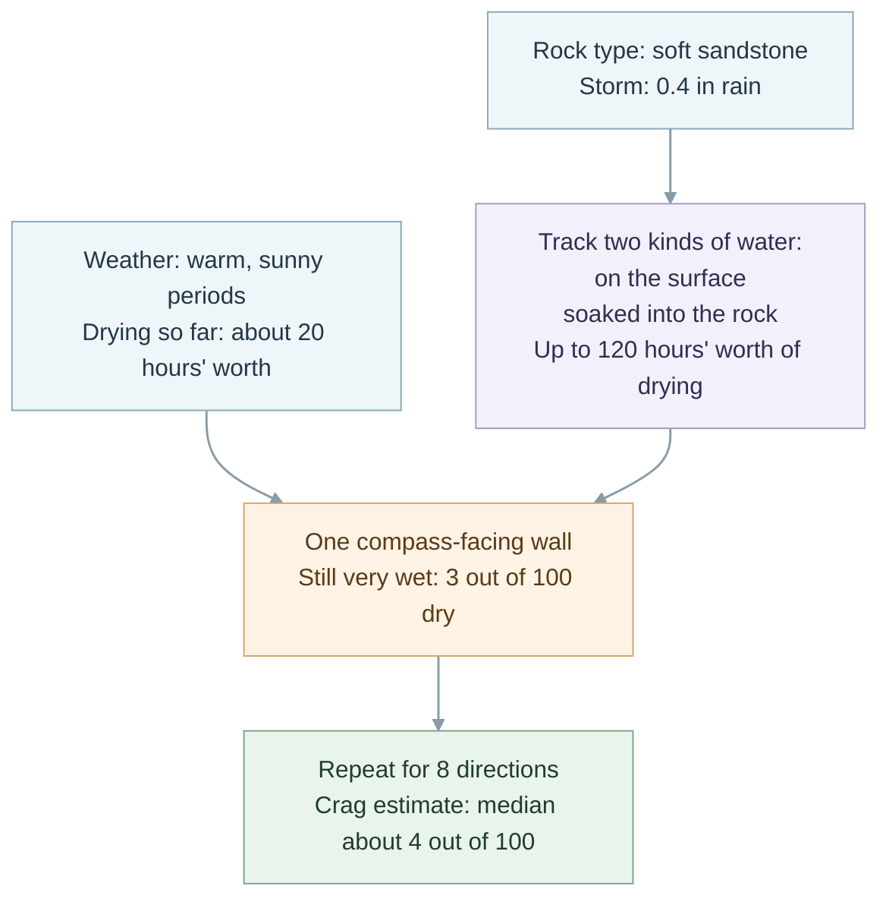
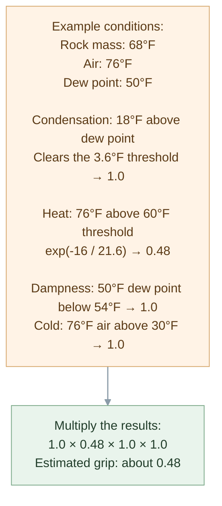
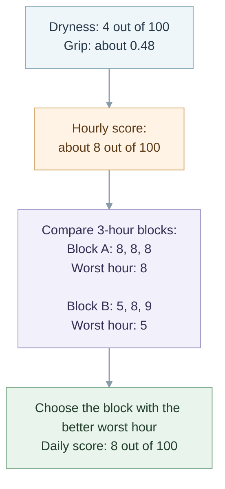

# WeatherTeam6

WeatherTeam6 helps climbers decide **when and where to climb**. Save a crag or another location to see the local forecast, recent rain, and an estimate of how climbable the rock may be over the coming days.

Open the app at [weatherteam6.vercel.app](https://weatherteam6.vercel.app). WeatherTeam6 is currently shared with a small group: you’ll need an account from the project owner to sign in.

## Use it to

- **Check conditions at your saved places.** See current weather readings and a seven-day outlook, then open a day for its hour-by-hour forecast.
- **Compare locations.** Save climbing areas and other places, and sort your list by the conditions estimate.
- **Get context for the rock.** For climbing locations, WeatherTeam6 considers recent precipitation, the forecast, and the rock type when estimating drying and grip. Known crags may have their rock type filled in automatically.
- **Review recent precipitation.** The Precip tab shows recent rain and snow estimates, including their timing and daily totals.
- **See active severe weather alerts.** Alerts are shown in the app when available for a saved location.

To get started, sign in, choose **Add**, search for a place (or enter its coordinates), preview its weather, and save it. When you save, choose whether the place is a climbing location (and, if so, its rock type) to see climbing-specific details. The app cannot change that choice after saving yet.

## About the conditions estimate

The score is a weather-based estimate, not a report from the crag. It combines an estimate of rock dryness with an estimate of climbing friction. Sun, shade, shelter, drainage, and conditions on a particular wall can differ from what the available weather data captures, so use the forecast as guidance and check the rock for yourself.

Forecasts and measurements come from external weather services. The app names the sources used for a location on its detail screen; coverage and available observations vary by place.

## What to expect

WeatherTeam6 is designed to help with day-to-day climbing decisions and short-range planning. The web app does not currently have a trip-planning screen. It does not send push notifications; severe weather alerts appear in the app when available, but are not sent to you separately.

The app can be added to a phone’s home screen. It needs an internet connection to load weather and location data.

## For contributors

WeatherTeam6 is a TypeScript monorepo managed with npm workspaces and Turborepo. The client and API are deployed as separate Vercel projects.

| Area | What lives there |
| --- | --- |
| `apps/miniapp` | The React web app: location search and previews, saved locations, forecasts, precipitation history, and climbing details. It builds to a static site and can be installed from a browser through its web app manifest; it has no service worker and does not work offline. |
| `apps/api` | The Express API, weather data integrations, scoring, authentication, and database access. It runs locally as a Node server and deploys through a Vercel serverless entry point. |
| `packages/types` | Types and shared domain helpers used by the client and API. |
| `packages/design` | Shared visual design tokens used by the web app. |
| `docs/handoffs` | Product, design, and feature handoffs. |
| `.claude/docs` | Project state and deeper technical references for contributors. |

### Local development

Use Node.js 20 or newer and the npm version specified by `package.json`. Install dependencies from the repository root:

```bash
npm ci
```

The install step builds the shared packages. The root scripts run across the workspaces:

```bash
npm run dev         # start the web app, the API, and a watch build of the design tokens
npm run build       # build all workspaces
npm run typecheck   # type-check all workspaces
npm run lint        # lint all workspaces
npm run test        # run all workspace tests
npm run check:hooks        # every registered Claude hook has a scenario
npm run check:crag-facts   # every crag fact carries a source and confidence
npm run check:icons        # the PWA icons still match the design tokens
```

CI runs every root-level `check:*` script, enumerated from `package.json`.

The API needs database and authentication settings to serve real data. See [.env.example](.env.example) for the variable names and [CLAUDE.md](CLAUDE.md) for project-specific setup and handling instructions. Set variables in the shell for the command that needs them rather than keeping a `.env` file. Note that the API's `dev` script loads `apps/api/.env` and fails when that file is absent; CLAUDE.md describes how to run the API locally without one. Production settings are held by the Vercel projects.

Database schema changes use Drizzle migrations:

```bash
npm run db:generate  # create a migration from schema changes
npm run db:migrate   # apply pending migrations (never drizzle-kit push)
npm run db:studio    # open the Drizzle database browser
```

### How the weather gets to the app

Forecasts are computed by the API when requested. Separate, authenticated HTTP endpoints collect weather runs, prune old runs, and refresh severe weather alerts on an external schedule; the project does not run a background queue. Weather providers and observations vary by location, and the detail screen names the sources used.

### Scoring models and algorithms

The app’s climbing score is **Crag A**: a weather-based estimate, not a measurement from the wall. These diagrams use one simplified example all the way through: soft sandstone after a 0.4-inch storm, with a warm afternoon forecast. The numbers are illustrative.

#### 1. Estimate rock dryness



Think of dryness as two timers: one for water on the surface, and one for water soaked deeper into the rock. Rain restarts the surface timer; a bigger storm can add time to the deeper timer. For soft sandstone after a soaking storm, the model allows up to 120 drying-hours. That is not a promise the rock will dry in 120 clock hours: warm, sunny weather advances the timers faster than cold, cloudy weather. “20 hours’ worth of drying” means the forecast adds up to that much drying in the model. It uses whichever timer says the rock is wetter. The 3/100 and 4/100 examples are points on the model’s dryness scale, not measured percentages of water in the rock. Snow can limit the result, and missing rain data leaves it unknown.

#### 2. Estimate grip

“Grip” estimates how temperature and moisture may affect how well the rock can be held. The model checks condensation, heat, damp air, and cold. Each check can lower the estimate:



Grip asks four simple questions: could water condense on the rock, is it too hot, is the air damp, or is it too cold? A value of 1.0 means that check does not reduce the estimate. The condensation check uses the modelled temperature of the rock mass, not the surface temperature the app displays. The heat formula uses a gradual penalty: `exp` means the factor falls smoothly as air temperature rises above 60°F, rather than dropping suddenly. The damp-air penalty starts above a 54°F dew point; the cold penalty starts below 30°F. Grip is an estimate, not a direct measurement.

#### 3. Turn hourly estimates into a daily score



The score runs from 0 to 100; higher means the model estimates more favorable conditions. For this example, the hourly calculation is `round(100 × 0.04^0.55 × 0.48) = 8`. The daily score uses the best three-hour block between 8 a.m. and 6 p.m.; a block is judged by its worst hour so one brief good hour does not make the whole block look good. A block that contains an unscored hour does not count.

Crag A estimates eight vertical faces around the compass and takes their median dryness; it does not score one specific recorded wall. If required inputs are missing, the score is withheld rather than shown as zero or treated as dry conditions. The model does not know about rain before its weather series begins, so it treats the rock as fully soaked at that point. As a result, a newly added crag can read wet for several days.

### Other scoring code

| Model | Status | What it does |
| --- | --- | --- |
| **Crag A** | Powers the climbing score in the app. | Combines dryness and grip into a 0–100 score. See [`cragModel.ts`](apps/api/src/lib/scoring/cragModel.ts). |
| **Hourly weather evaluation** | Supports Crag A. | Estimates rock temperatures and weather-driven drying inputs; its separate score is not the score shown in the app. |
| **Wall A** | Implemented in the API, not used by the app. | Applies the model to one wall, including its orientation, angle, and rain shelter. |
| **Five-part scorer** | Retained in the forecast code; not the app’s climbing score. | The earlier model allocates 40 points to drying, 25 to upcoming rain, 15 to wind, 12 to temperature, and 8 to humidity. |

The model contains assumptions that have not been validated against climbing outcomes. Use its scores as decision support, and check actual conditions at the crag. More detail is in the [scoring algorithm notes](.claude/docs/scoring-algorithm.md) and [scoring findings](.claude/docs/scoring-findings.md).

### Useful project references

- [Current project state](.claude/docs/STATE.md)
- [Architecture rules](.claude/rules/architecture.md)
- [Defect patterns](.claude/rules/defect-patterns.md) — read before reviewing a diff
- [Data model](.claude/docs/data-model.md)
- [Scoring model](.claude/docs/scoring-algorithm.md) and [scoring findings](.claude/docs/scoring-findings.md)
- [Weather source notes](.claude/docs/api-sources.md)
- [Web app README](apps/miniapp/README.md)
- [Web app screen spec](docs/handoffs/miniapp-design-v1.md), [design system](docs/handoffs/design-system-v1.md), and the [mockup](docs/handoffs/design-mockups/weatherteam6UI.html) itself

These references can evolve alongside the code; when they disagree, verify behavior in the current implementation.
